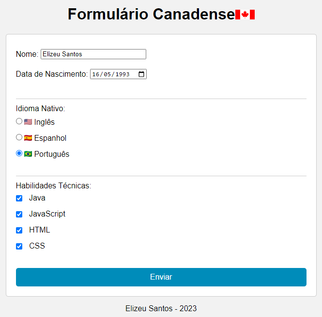
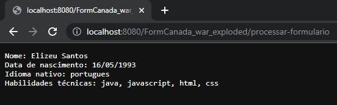

## Desenvolvimento Web III - Formulário de candidatura a uma vaga de emprego no Canadá

<h1 align="center">

</h1>

<h2 align="center">

</h2>

Este repositório contém uma aplicação web desenvolvida como projeto para a disciplina de Desenvolvimento Web III, do curso de Análise de Desenvolvimento de Sistemas do Instituto Federal do Paraná.

A aplicação consiste em um formulário para candidatura a uma vaga de emprego no Canadá, que contém os seguintes campos:

- Nome
- Data de nascimento
- Idioma nativo (inglês, espanhol ou português)
- Habilidades técnicas (Java, JavaScript, HTML e CSS)

A aplicação é baseada em tecnologia web, Servlets Java.

## Instruções de uso

1. Clone este repositório em sua máquina local
2. Importe o projeto em sua IDE de preferência (Eclipse, IntelliJ, NetBeans, etc.)
3. Execute o servidor de aplicação (Tomcat, Jetty, etc.)
4. Abra o navegador web e acesse o endereço http://localhost:8080/candidatura
5. Preencha o formulário de candidatura e clique no botão "Enviar"
6. Caso algum campo esteja em branco ou preenchido incorretamente, uma mensagem de erro será exibida. Caso contrário, as informações serão mostradas na tela devidamente formatadas para o usuário.
